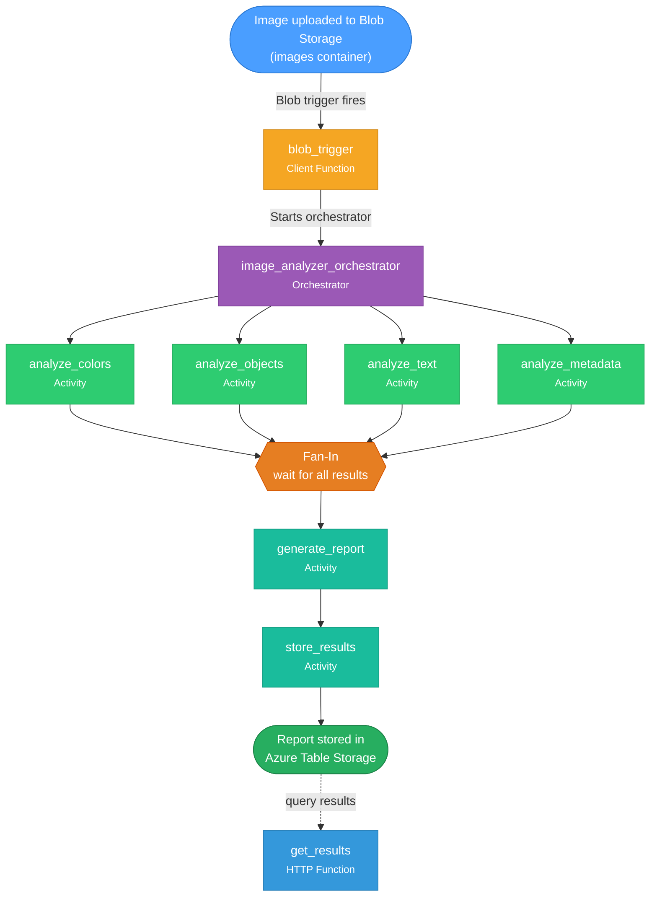
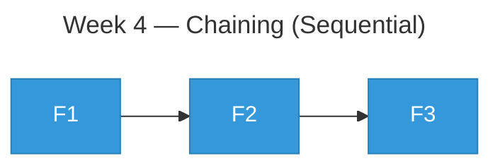
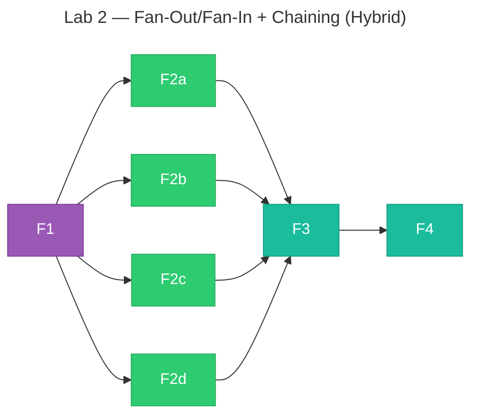

# Lab 2: Smart Image Analyzer with Durable Functions

## CST8917 - Serverless Applications | Winter 2026

---

## Overview

In Week 4, you built your first Durable Function using the **Function Chaining** pattern - calling activities one after another in sequence. In this lab, you'll build a **Smart Image Analyzer** that uses the **Fan-Out/Fan-In** pattern to run multiple analyses on an image **in parallel**.

When an image is uploaded to Azure Blob Storage, your Durable Function will automatically trigger and run four different analyses simultaneously - then combine them into a single report stored in Azure Table Storage.

**What You'll Learn:**
- Implement the Fan-Out/Fan-In pattern with Durable Functions
- Use a Blob Storage trigger to start orchestrations automatically
- Run multiple activity functions in parallel using `context.task_all()`
- Store structured results in Azure Table Storage
- Retrieve results via an HTTP endpoint

**Prerequisites:**
- Completed Week 4 Durable Functions Exercise
- VS Code with Azure Functions Extension installed
- Azure Functions Core Tools installed
- Python 3.11 or 3.12 installed
- Azure Storage Explorer (standalone app) — [Download here](https://azure.microsoft.com/features/storage-explorer/)
- **WSL/Linux only:** `libsecret-1-0` package (required for Azure Storage Explorer and AzCopy uploads — see Part 1 setup below)

---

## Architecture



### Pattern Comparison: Week 4 vs. Lab 2

| Aspect         | Week 4 (City Info)                    | Lab 2 (Image Analyzer)               |
| -------------- | ------------------------------------- | ------------------------------------ |
| **Pattern**    | Function Chaining (sequential)        | Fan-Out/Fan-In + Chaining (hybrid)   |
| **Trigger**    | HTTP request                          | Blob Storage upload                  |
| **Activities** | 1 activity called 3 times             | 4 different activities in parallel   |
| **Data flow**  | Same activity, different input        | Different activities, same input     |
| **Output**     | Return directly                       | Store in Table Storage               |
| **Execution**  | One at a time: F1 &rarr; F2 &rarr; F3 | Parallel: F1, F2, F3, F4 all at once |

### Why Fan-Out/Fan-In?

In Week 4, you called `get_city_info` three times **in sequence** - each call waited for the previous one to finish. That was fine for three quick operations, but what if each analysis takes 5 seconds?

- **Sequential (Chaining):** 4 analyses x 5 seconds = **20 seconds total**
- **Parallel (Fan-Out/Fan-In):** 4 analyses running simultaneously = **~5 seconds total**

Fan-Out/Fan-In is the right pattern when you have **multiple independent tasks** that don't depend on each other's results.

---

## Part 1: Create the Project

### Step 1.1: Create a New Functions Project

1. Press `F1` to open the Command Palette
2. Select **Azure Functions: Create New Project...**
3. Choose a new empty folder (e.g., `ImageAnalyzerLab`)

| Prompt                          | Your Selection             |
| ------------------------------- | -------------------------- |
| **Select a language**           | `Python`                   |
| **Select a Python interpreter** | Choose Python 3.11 or 3.12 |
| **Select a template**           | `Skip for now`             |
| **Open project**                | `Open in current window`   |

> **Important:** Select **Skip for now** when asked for a template, just like in the Week 4 exercise.

### Step 1.2: Install Required Packages

Open `requirements.txt` and replace its contents with:

```
azure-functions
azure-functions-durable
azure-data-tables
Pillow
```

| Package                   | Purpose                                           |
| ------------------------- | ------------------------------------------------- |
| `azure-functions`         | Azure Functions SDK (same as always)              |
| `azure-functions-durable` | Durable Functions extension (same as Week 4)      |
| `azure-data-tables`       | Azure Table Storage SDK for storing results       |
| `Pillow`                  | Python Imaging Library for reading image metadata |

Install the packages:

```bash
source .venv/bin/activate
python -m pip install -r requirements.txt
```

> **Windows:** Use `.venv\Scripts\activate` instead.

### Step 1.3: Configure Local Settings

Open `local.settings.json` and replace its contents with:

```json
{
  "IsEncrypted": false,
  "Values": {
    "AzureWebJobsStorage": "UseDevelopmentStorage=true",
    "FUNCTIONS_WORKER_RUNTIME": "python",
    "ImageStorageConnection": "UseDevelopmentStorage=true"
  },
  "Host": {
    "CORS": "*"
  }
}
```

| Setting                  | Purpose                                                |
| ------------------------ | ------------------------------------------------------ |
| `AzureWebJobsStorage`    | Durable Functions state storage (same as Week 4)       |
| `ImageStorageConnection` | Connection for the Blob trigger and Table Storage      |
| `CORS`                   | Allows cross-origin requests to the function endpoints |

> **Note:** Both connection strings point to Azurite for local development. When you deploy to Azure, these will point to your real storage account.

---

## Part 2: Understand the Code Architecture

Before writing code, let's understand how the pieces fit together. You will write **8 functions** in a single file:

| #   | Function                      | Type         | Role                                                    |
| --- | ----------------------------- | ------------ | ------------------------------------------------------- |
| 1   | `blob_trigger`                | Client       | Detects image upload, starts the orchestrator           |
| 2   | `image_analyzer_orchestrator` | Orchestrator | Coordinates the workflow: fan-out, fan-in, then chain   |
| 3   | `analyze_colors`              | Activity     | Extracts dominant colors from the image                 |
| 4   | `analyze_objects`             | Activity     | Detects objects/content in the image (mock)             |
| 5   | `analyze_text`                | Activity     | Performs OCR - extracts text from the image (mock)      |
| 6   | `analyze_metadata`            | Activity     | Extracts real image metadata (dimensions, format, size) |
| 7   | `generate_report`             | Activity     | Combines all four analyses into a unified report        |
| 8   | `store_results`               | Activity     | Saves the report to Azure Table Storage                 |

Plus one additional HTTP function:

| #   | Function      | Type | Role                                                 |
| --- | ------------- | ---- | ---------------------------------------------------- |
| 9   | `get_results` | HTTP | Retrieves stored analysis results from Table Storage |

### The Fan-Out/Fan-In in Code

Here's the key difference from Week 4. In Week 4, you called activities **sequentially**:

```python
# Week 4: Sequential (Chaining)
result1 = yield context.call_activity("get_city_info", "Ottawa")
result2 = yield context.call_activity("get_city_info", "Toronto")     # waits for Ottawa
result3 = yield context.call_activity("get_city_info", "Vancouver")   # waits for Toronto
```

In this lab, you'll call activities **in parallel**:

```python
# Lab 2: Parallel (Fan-Out/Fan-In)
tasks = [
    context.call_activity("analyze_colors", blob_url),      # starts immediately
    context.call_activity("analyze_objects", blob_url),      # starts immediately
    context.call_activity("analyze_text", blob_url),         # starts immediately
    context.call_activity("analyze_metadata", blob_url),     # starts immediately
]
results = yield context.task_all(tasks)   # wait for ALL to finish
```

Notice: **no `yield` on each `call_activity`**. Instead, you collect all the tasks into a list and `yield context.task_all(tasks)` waits for all of them to complete simultaneously. This is the Fan-Out/Fan-In pattern.

---

## Part 3: Write the Code

Open `function_app.py` and replace its entire contents with the code below. Read the comments carefully - they explain each section.

```python
# =============================================================================
# IMPORTS
# =============================================================================
import azure.functions as func            # Azure Functions SDK
import azure.durable_functions as df      # Durable Functions extension
from azure.data.tables import TableServiceClient, TableClient  # Table Storage SDK
from PIL import Image                     # Pillow - image processing library
import logging                            # Python built-in logging
import json                               # Python built-in JSON handling
import io                                 # Python built-in for byte stream handling
import os                                 # Python built-in for environment variables
import uuid                               # Python built-in for generating unique IDs
from datetime import datetime             # Python built-in for timestamps

# =============================================================================
# CREATE THE DURABLE FUNCTION APP
# =============================================================================
# Same as Week 4: df.DFApp instead of func.FunctionApp
myApp = df.DFApp(http_auth_level=func.AuthLevel.ANONYMOUS)

# =============================================================================
# TABLE STORAGE HELPER
# =============================================================================
# This helper function creates a connection to Azure Table Storage.
# It uses the same connection string as our Blob trigger.
# For local development, this connects to Azurite's Table Storage emulator.
TABLE_NAME = "ImageAnalysisResults"

def get_table_client():
    """Get a TableClient for storing/retrieving analysis results."""
    connection_string = os.environ["ImageStorageConnection"]
    table_service = TableServiceClient.from_connection_string(connection_string)
    # create_table_if_not_exists ensures the table exists before we use it
    table_service.create_table_if_not_exists(TABLE_NAME)
    return table_service.get_table_client(TABLE_NAME)

# =============================================================================
# 1. CLIENT FUNCTION (Blob Trigger - The Entry Point)
# =============================================================================
# Unlike Week 4 where you used an HTTP trigger, this function triggers
# automatically when an image is uploaded to the "images" container.
#
# How it works:
#   1. User uploads an image to the "images" container in Blob Storage
#   2. Azure detects the new blob and triggers this function
#   3. This function starts the orchestrator, passing the blob name
#
# The path "images/{name}" means:
#   - Watch the "images" container
#   - {name} captures the filename (e.g., "photo.jpg")
@myApp.blob_trigger(
    arg_name="myblob",
    path="images/{name}",
    connection="ImageStorageConnection"
)
@myApp.durable_client_input(client_name="client")
async def blob_trigger(myblob: func.InputStream, client):
    # Get the blob name (e.g., "images/photo.jpg")
    blob_name = myblob.name
    # Read the blob content as bytes (the actual image data)
    blob_bytes = myblob.read()
    # Get the file size in KB
    blob_size_kb = round(len(blob_bytes) / 1024, 2)

    logging.info(f"New image detected: {blob_name} ({blob_size_kb} KB)")

    # Prepare input data for the orchestrator
    # We pass the blob name and the raw image bytes (as a list of integers)
    # Note: We convert bytes to a list because Durable Functions serialize
    # inputs as JSON, and JSON doesn't support raw bytes
    input_data = {
        "blob_name": blob_name,
        "blob_bytes": list(blob_bytes),
        "blob_size_kb": blob_size_kb
    }

    # Start the orchestrator (same concept as Week 4's client.start_new)
    instance_id = await client.start_new(
        "image_analyzer_orchestrator",
        client_input=input_data
    )

    logging.info(f"Started orchestration {instance_id} for {blob_name}")

# =============================================================================
# 2. ORCHESTRATOR FUNCTION (The Workflow Manager)
# =============================================================================
# This orchestrator implements a HYBRID pattern:
#   - Fan-Out/Fan-In: Run 4 analyses in parallel
#   - Chaining: Then generate report -> store results (sequential)
#
# Compare to Week 4's orchestrator:
#   Week 4: yield call_activity(...) three times sequentially
#   Lab 2:  yield context.task_all([...]) for parallel, then yield for sequential
@myApp.orchestration_trigger(context_name="context")
def image_analyzer_orchestrator(context):
    # Get the input data passed from the blob trigger
    input_data = context.get_input()

    logging.info(f"Orchestrator started for: {input_data['blob_name']}")

    # =========================================================================
    # STEP 1: FAN-OUT - Run all 4 analyses in parallel
    # =========================================================================
    # Create a list of tasks WITHOUT yielding each one individually.
    # Each call_activity starts a task but doesn't wait for it.
    analysis_tasks = [
        context.call_activity("analyze_colors", input_data),
        context.call_activity("analyze_objects", input_data),
        context.call_activity("analyze_text", input_data),
        context.call_activity("analyze_metadata", input_data),
    ]

    # FAN-IN: yield context.task_all() waits for ALL tasks to complete.
    # This is the key difference from Week 4's sequential yield.
    # All 4 activities run simultaneously, and we get all results at once.
    results = yield context.task_all(analysis_tasks)

    # results is a list in the same order as analysis_tasks:
    # results[0] = analyze_colors result
    # results[1] = analyze_objects result
    # results[2] = analyze_text result
    # results[3] = analyze_metadata result

    # =========================================================================
    # STEP 2: CHAIN - Generate report from combined results
    # =========================================================================
    # Now we chain: take the parallel results and combine them into a report.
    # This must happen AFTER all analyses complete (sequential).
    report_input = {
        "blob_name": input_data["blob_name"],
        "colors": results[0],
        "objects": results[1],
        "text": results[2],
        "metadata": results[3],
    }

    report = yield context.call_activity("generate_report", report_input)

    # =========================================================================
    # STEP 3: CHAIN - Store the report in Table Storage
    # =========================================================================
    # Final step: persist the report to Azure Table Storage.
    record = yield context.call_activity("store_results", report)

    return record

# =============================================================================
# 3. ACTIVITY: Analyze Colors
# =============================================================================
# This activity extracts dominant colors from the image using Pillow.
# It samples pixels from the image and identifies the most common colors.
#
# In a production app, you might use Azure Computer Vision API instead.
@myApp.activity_trigger(input_name="inputData")
def analyze_colors(inputData: dict):
    logging.info("Analyzing colors...")

    try:
        # Convert the byte list back to bytes, then open as an image
        image_bytes = bytes(inputData["blob_bytes"])
        image = Image.open(io.BytesIO(image_bytes))

        # Convert to RGB if necessary (handles PNG with alpha, grayscale, etc.)
        if image.mode != "RGB":
            image = image.convert("RGB")

        # Resize to a small size for faster color sampling
        # We don't need full resolution just to get dominant colors
        small_image = image.resize((50, 50))

        # Get all pixels as a list of (R, G, B) tuples
        pixels = list(small_image.getdata())

        # Count occurrences of each color (rounded to nearest 10 for grouping)
        color_counts = {}
        for r, g, b in pixels:
            # Round to nearest 32 to group similar colors together
            key = (r // 32 * 32, g // 32 * 32, b // 32 * 32)
            color_counts[key] = color_counts.get(key, 0) + 1

        # Sort by frequency and get top 5 colors
        sorted_colors = sorted(color_counts.items(), key=lambda x: x[1], reverse=True)
        top_colors = []
        for (r, g, b), count in sorted_colors[:5]:
            hex_color = f"#{r:02x}{g:02x}{b:02x}"
            top_colors.append({
                "hex": hex_color,
                "rgb": {"r": r, "g": g, "b": b},
                "percentage": round(count / len(pixels) * 100, 1)
            })

        # Determine if image is mostly grayscale
        # In grayscale images, R, G, and B values are very close to each other
        grayscale_pixels = sum(1 for r, g, b in pixels if abs(r - g) < 30 and abs(g - b) < 30)
        is_grayscale = grayscale_pixels / len(pixels) > 0.9

        return {
            "dominantColors": top_colors,
            "isGrayscale": is_grayscale,
            "totalPixelsSampled": len(pixels)
        }

    except Exception as e:
        logging.error(f"Color analysis failed: {str(e)}")
        return {
            "dominantColors": [],
            "isGrayscale": False,
            "totalPixelsSampled": 0,
            "error": str(e)
        }

# =============================================================================
# 4. ACTIVITY: Analyze Objects (Mock)
# =============================================================================
# This activity simulates object detection.
# In a production app, you would call Azure Computer Vision API here.
#
# Why mock? Calling an external API requires API keys and costs money.
# The mock lets you focus on learning the Durable Functions pattern.
# The "Stretch Goal" section at the end shows how to swap in the real API.
@myApp.activity_trigger(input_name="inputData")
def analyze_objects(inputData: dict):
    logging.info("Analyzing objects...")

    try:
        image_bytes = bytes(inputData["blob_bytes"])
        image = Image.open(io.BytesIO(image_bytes))
        width, height = image.size

        # Mock object detection based on image characteristics
        # A real API would return actual detected objects
        mock_objects = []

        # Simulate detection based on image dimensions and properties
        if width > height:
            mock_objects.append({"name": "landscape", "confidence": 0.85})
        elif height > width:
            mock_objects.append({"name": "portrait", "confidence": 0.82})
        else:
            mock_objects.append({"name": "square composition", "confidence": 0.90})

        # Add some generic objects based on image size
        if width * height > 1000000:  # > 1 megapixel
            mock_objects.append({"name": "high-resolution scene", "confidence": 0.78})

        mock_objects.append({"name": "digital image", "confidence": 0.99})

        return {
            "objects": mock_objects,
            "objectCount": len(mock_objects),
            "note": "Mock analysis - replace with Azure Computer Vision for real detection"
        }

    except Exception as e:
        logging.error(f"Object analysis failed: {str(e)}")
        return {
            "objects": [],
            "objectCount": 0,
            "error": str(e)
        }

# =============================================================================
# 5. ACTIVITY: Analyze Text / OCR (Mock)
# =============================================================================
# This activity simulates Optical Character Recognition (OCR).
# In a production app, you would call Azure Computer Vision Read API.
@myApp.activity_trigger(input_name="inputData")
def analyze_text(inputData: dict):
    logging.info("Analyzing text (OCR)...")

    try:
        image_bytes = bytes(inputData["blob_bytes"])
        image = Image.open(io.BytesIO(image_bytes))

        # Mock OCR analysis
        # Real OCR would scan the image for any visible text
        # Here we simulate by checking image properties
        width, height = image.size

        return {
            "hasText": False,
            "extractedText": "",
            "confidence": 0.0,
            "language": "unknown",
            "note": "Mock OCR - replace with Azure Computer Vision Read API for real text extraction"
        }

    except Exception as e:
        logging.error(f"Text analysis failed: {str(e)}")
        return {
            "hasText": False,
            "extractedText": "",
            "confidence": 0.0,
            "error": str(e)
        }

# =============================================================================
# 6. ACTIVITY: Analyze Metadata (Real Analysis)
# =============================================================================
# Unlike the mock activities above, this one performs REAL analysis.
# Pillow can extract actual image metadata: dimensions, format, color mode,
# and EXIF data (camera info, GPS coordinates, etc.)
@myApp.activity_trigger(input_name="inputData")
def analyze_metadata(inputData: dict):
    logging.info("Analyzing metadata...")

    try:
        image_bytes = bytes(inputData["blob_bytes"])
        blob_size_kb = inputData["blob_size_kb"]
        image = Image.open(io.BytesIO(image_bytes))

        width, height = image.size
        total_pixels = width * height

        # Try to extract EXIF data (camera info, date taken, etc.)
        exif_data = {}
        try:
            raw_exif = image._getexif()
            if raw_exif:
                # Map EXIF tag numbers to human-readable names
                from PIL.ExifTags import TAGS
                for tag_id, value in raw_exif.items():
                    tag_name = TAGS.get(tag_id, tag_id)
                    # Only include string/number values (skip binary data)
                    if isinstance(value, (str, int, float)):
                        exif_data[str(tag_name)] = str(value)
        except (AttributeError, Exception):
            # Not all image formats support EXIF
            pass

        return {
            "width": width,
            "height": height,
            "format": image.format or "Unknown",
            "mode": image.mode,
            "totalPixels": total_pixels,
            "megapixels": round(total_pixels / 1000000, 2),
            "sizeKB": blob_size_kb,
            "aspectRatio": f"{width}:{height}",
            "hasExifData": len(exif_data) > 0,
            "exifData": exif_data
        }

    except Exception as e:
        logging.error(f"Metadata analysis failed: {str(e)}")
        return {
            "width": 0,
            "height": 0,
            "format": "Unknown",
            "error": str(e)
        }

# =============================================================================
# 7. ACTIVITY: Generate Report
# =============================================================================
# This activity takes the results from all 4 analyses and combines them
# into a single unified report. This is the "reduce" step after the fan-in.
@myApp.activity_trigger(input_name="reportData")
def generate_report(reportData: dict):
    logging.info("Generating combined report...")

    blob_name = reportData["blob_name"]
    # Extract just the filename from the full path (e.g., "images/photo.jpg" -> "photo.jpg")
    filename = blob_name.split("/")[-1] if "/" in blob_name else blob_name

    report = {
        "id": str(uuid.uuid4()),
        "fileName": filename,
        "blobPath": blob_name,
        "analyzedAt": datetime.utcnow().isoformat(),
        "analyses": {
            "colors": reportData["colors"],
            "objects": reportData["objects"],
            "text": reportData["text"],
            "metadata": reportData["metadata"],
        },
        "summary": {
            "imageSize": f"{reportData['metadata'].get('width', 0)}x{reportData['metadata'].get('height', 0)}",
            "format": reportData["metadata"].get("format", "Unknown"),
            "dominantColor": reportData["colors"]["dominantColors"][0]["hex"] if reportData["colors"].get("dominantColors") else "N/A",
            "objectsDetected": reportData["objects"].get("objectCount", 0),
            "hasText": reportData["text"].get("hasText", False),
            "isGrayscale": reportData["colors"].get("isGrayscale", False),
        }
    }

    logging.info(f"Report generated: {report['id']}")
    return report

# =============================================================================
# 8. ACTIVITY: Store Results in Table Storage
# =============================================================================
# This activity saves the generated report to Azure Table Storage.
#
# Table Storage requires two keys:
#   - PartitionKey: Groups related entities (we use "ImageAnalysis")
#   - RowKey: Unique identifier within the partition (we use the report ID)
@myApp.activity_trigger(input_name="report")
def store_results(report: dict):
    logging.info(f"Storing results for {report['fileName']}...")

    try:
        table_client = get_table_client()

        # Table Storage entities are flat key-value pairs.
        # Complex nested data (like our analyses) must be serialized as JSON strings.
        entity = {
            "PartitionKey": "ImageAnalysis",
            "RowKey": report["id"],
            "FileName": report["fileName"],
            "BlobPath": report["blobPath"],
            "AnalyzedAt": report["analyzedAt"],
            # Store complex data as JSON strings
            "Summary": json.dumps(report["summary"]),
            "ColorAnalysis": json.dumps(report["analyses"]["colors"]),
            "ObjectAnalysis": json.dumps(report["analyses"]["objects"]),
            "TextAnalysis": json.dumps(report["analyses"]["text"]),
            "MetadataAnalysis": json.dumps(report["analyses"]["metadata"]),
        }

        table_client.upsert_entity(entity)

        logging.info(f"Results stored with ID: {report['id']}")

        return {
            "id": report["id"],
            "fileName": report["fileName"],
            "status": "stored",
            "analyzedAt": report["analyzedAt"],
            "summary": report["summary"]
        }

    except Exception as e:
        logging.error(f"Failed to store results: {str(e)}")
        return {
            "id": report.get("id", "unknown"),
            "status": "error",
            "error": str(e)
        }

# =============================================================================
# 9. HTTP FUNCTION: Get Analysis Results
# =============================================================================
# This is a regular HTTP function (like Week 2) that retrieves stored results
# from Table Storage. It's NOT part of the orchestration - it's a separate
# endpoint for users to query past analyses.
#
# Usage:
#   GET /api/results          - Get all results (last 10)
#   GET /api/results?limit=5  - Get last 5 results
#   GET /api/results/{id}     - Get a specific result by ID
@myApp.route(route="results/{id?}")
def get_results(req: func.HttpRequest) -> func.HttpResponse:
    logging.info("Get results endpoint called")

    try:
        table_client = get_table_client()
        result_id = req.route_params.get("id")

        if result_id:
            # Get a specific result by ID
            try:
                entity = table_client.get_entity(
                    partition_key="ImageAnalysis",
                    row_key=result_id
                )

                # Parse JSON strings back into objects
                result = {
                    "id": entity["RowKey"],
                    "fileName": entity["FileName"],
                    "blobPath": entity["BlobPath"],
                    "analyzedAt": entity["AnalyzedAt"],
                    "summary": json.loads(entity["Summary"]),
                    "analyses": {
                        "colors": json.loads(entity["ColorAnalysis"]),
                        "objects": json.loads(entity["ObjectAnalysis"]),
                        "text": json.loads(entity["TextAnalysis"]),
                        "metadata": json.loads(entity["MetadataAnalysis"]),
                    }
                }

                return func.HttpResponse(
                    json.dumps(result, indent=2),
                    mimetype="application/json",
                    status_code=200
                )

            except Exception:
                return func.HttpResponse(
                    json.dumps({"error": f"Result not found: {result_id}"}),
                    mimetype="application/json",
                    status_code=404
                )
        else:
            # Get all results (with optional limit)
            limit = int(req.params.get("limit", "10"))

            entities = table_client.query_entities(
                query_filter="PartitionKey eq 'ImageAnalysis'"
            )

            results = []
            for entity in entities:
                results.append({
                    "id": entity["RowKey"],
                    "fileName": entity["FileName"],
                    "analyzedAt": entity["AnalyzedAt"],
                    "summary": json.loads(entity["Summary"]),
                })

            # Sort by analyzedAt descending (most recent first)
            results.sort(key=lambda x: x["analyzedAt"], reverse=True)
            results = results[:limit]

            return func.HttpResponse(
                json.dumps({"count": len(results), "results": results}, indent=2),
                mimetype="application/json",
                status_code=200
            )

    except Exception as e:
        logging.error(f"Failed to retrieve results: {str(e)}")
        return func.HttpResponse(
            json.dumps({"error": str(e)}),
            mimetype="application/json",
            status_code=500
        )
```

---

## Part 4: Understanding the Code

Take a moment to understand how this code differs from Week 4.

### 4.1 Blob Trigger vs. HTTP Trigger

**Week 4 (HTTP Trigger):**
```python
@myApp.route(route="orchestrators/{functionName}")
@myApp.durable_client_input(client_name="client")
async def http_start(req: func.HttpRequest, client):
    function_name = req.route_params.get('functionName')
    instance_id = await client.start_new(function_name)
    return client.create_check_status_response(req, instance_id)
```

**Lab 2 (Blob Trigger):**
```python
@myApp.blob_trigger(arg_name="myblob", path="images/{name}", connection="ImageStorageConnection")
@myApp.durable_client_input(client_name="client")
async def blob_trigger(myblob: func.InputStream, client):
    instance_id = await client.start_new("image_analyzer_orchestrator", client_input=input_data)
```

Key differences:
- **No HTTP response** - Blob triggers are fire-and-forget; there's no client waiting for a response
- **Automatic** - No one needs to call a URL; uploading a file triggers the function
- **`client_input`** - We pass the image data to the orchestrator via `client_input`

### 4.2 Fan-Out/Fan-In vs. Sequential Chaining

**Week 4 (Sequential):**
```python
result1 = yield context.call_activity("get_city_info", "Ottawa")      # ~1 sec
result2 = yield context.call_activity("get_city_info", "Toronto")     # ~1 sec (after Ottawa)
result3 = yield context.call_activity("get_city_info", "Vancouver")   # ~1 sec (after Toronto)
# Total: ~3 seconds
```

**Lab 2 (Parallel):**
```python
tasks = [
    context.call_activity("analyze_colors", input_data),      # starts now
    context.call_activity("analyze_objects", input_data),      # starts now
    context.call_activity("analyze_text", input_data),         # starts now
    context.call_activity("analyze_metadata", input_data),     # starts now
]
results = yield context.task_all(tasks)  # wait for ALL
# Total: ~1 second (all run simultaneously)
```

### 4.3 Real vs. Mock Analysis

| Activity           | Real or Mock? | What it actually does                                       |
| ------------------ | ------------- | ----------------------------------------------------------- |
| `analyze_colors`   | **Real**      | Uses Pillow to sample pixels and find dominant colors       |
| `analyze_objects`  | **Mock**      | Returns simulated objects based on image dimensions         |
| `analyze_text`     | **Mock**      | Returns empty OCR results (placeholder)                     |
| `analyze_metadata` | **Real**      | Uses Pillow to extract actual dimensions, format, EXIF data |

> **Why mock some activities?** Calling Azure Computer Vision API requires API keys, costs money, and adds complexity. The mock activities let you focus on the Durable Functions orchestration pattern. See the **Stretch Goal** at the end if you want to integrate the real API.

---

## Part 5: Run and Test Locally

### Step 5.1: Start Azurite

Durable Functions and Table Storage both require Azurite locally.

1. Press `F1` to open the Command Palette
2. Select **Azurite: Start**
3. Verify the status bar shows Azurite is running

> **CLI alternative:** `azurite --silent --location .azurite --debug .azurite/debug.log`

### Step 5.2: Create the Images Container

Before uploading images, you need to create the `images` container in Azurite. The easiest way is using the **Azure Storage Explorer** extension in VS Code or the standalone Azure Storage Explorer app.

#### Option A: Using VS Code Azure Extension

1. Click the **Azure icon** in the Activity bar
2. Expand **Workspace** > **Attached Storage Accounts** > **Local Emulator** > **Blob Containers**
3. Right-click **Blob Containers** and select **Create Blob Container**
4. Name it `images`

#### Option B: Using Azure Storage Explorer (Standalone App)

1. Open [Azure Storage Explorer](https://azure.microsoft.com/features/storage-explorer/)
2. Connect to **Local & Attached** > **Storage Accounts** > **(Emulator - Default Ports)**
3. Right-click **Blob Containers** > **Create Blob Container**
4. Name it `images`

#### Option C: Using the Command Line (curl)

```bash
curl -X PUT "http://127.0.0.1:10000/devstoreaccount1/images?restype=container" \
  -H "x-ms-version: 2020-10-02"
```

### Step 5.3: Start the Function App

1. Press `F5` or run `func start` in the terminal

2. Wait for the output to show the available endpoints:

   ```
   Functions:

           blob_trigger: blobTrigger

           image_analyzer_orchestrator: orchestrationTrigger

           analyze_colors: activityTrigger

           analyze_objects: activityTrigger

           analyze_text: activityTrigger

           analyze_metadata: activityTrigger

           generate_report: activityTrigger

           store_results: activityTrigger

           get_results: [GET] http://localhost:7071/api/results/{id?}
   ```

   Notice: Only `get_results` has an HTTP URL. The blob trigger, orchestrator, and activities are all triggered internally.

### Step 5.4: Upload a Test Image

Upload any image (JPEG, PNG, etc.) to the `images` container to trigger the orchestration.

#### Option A: Using Azure Storage Explorer

1. In Azure Storage Explorer, navigate to **Local Emulator** > **Blob Containers** > **images**
2. Click **Upload** > **Upload Files**
3. Select any image file from your computer
4. Click **Upload**

#### Option B: Using the Command Line (curl)

```bash
curl -X PUT "http://127.0.0.1:10000/devstoreaccount1/images/test-image.jpg" \
  -H "x-ms-version: 2020-10-02" \
  -H "x-ms-blob-type: BlockBlob" \
  -H "Content-Type: image/jpeg" \
  --data-binary @/path/to/your/image.jpg
```

> **Replace** `/path/to/your/image.jpg` with the actual path to an image on your computer.

### Step 5.5: Observe the Orchestration

Watch the terminal output. You should see logs like:

```
[2026-02-10T14:30:00.000Z] New image detected: images/test-image.jpg (245.67 KB)
[2026-02-10T14:30:00.100Z] Started orchestration abc123... for images/test-image.jpg
[2026-02-10T14:30:00.200Z] Orchestrator started for: images/test-image.jpg
[2026-02-10T14:30:00.300Z] Analyzing colors...
[2026-02-10T14:30:00.300Z] Analyzing objects...
[2026-02-10T14:30:00.300Z] Analyzing text (OCR)...
[2026-02-10T14:30:00.300Z] Analyzing metadata...
[2026-02-10T14:30:00.500Z] Generating combined report...
[2026-02-10T14:30:00.600Z] Storing results for test-image.jpg...
[2026-02-10T14:30:00.700Z] Results stored with ID: a1b2c3d4-...
```

> **Key observation:** Notice that all four "Analyzing..." messages appear at nearly the same time. This shows they are running **in parallel** (Fan-Out). In Week 4's chaining pattern, you would see each activity start only after the previous one completed.

### Step 5.6: Retrieve the Results

Use the HTTP endpoint to check the stored results:

**Get all results:**
```
http://localhost:7071/api/results
```

**Expected response:**
```json
{
  "count": 1,
  "results": [
    {
      "id": "a1b2c3d4-e5f6-7890-abcd-ef1234567890",
      "fileName": "test-image.jpg",
      "analyzedAt": "2026-02-10T14:30:00.500000",
      "summary": {
        "imageSize": "1920x1080",
        "format": "JPEG",
        "dominantColor": "#404040",
        "objectsDetected": 3,
        "hasText": false,
        "isGrayscale": false
      }
    }
  ]
}
```

**Get a specific result (copy the ID from above):**
```
http://localhost:7071/api/results/a1b2c3d4-e5f6-7890-abcd-ef1234567890
```

This returns the full analysis including all four analysis sections (colors, objects, text, metadata).

### Step 5.7: Test with Multiple Images

Upload 2-3 different images to the `images` container. Each upload triggers a new orchestration. Then query `/api/results` to see all stored analyses.

Try different image types:
- A color photograph (JPEG)
- A screenshot with text (PNG)
- A grayscale image

---

## Part 6: Test with the .http File

Open the `test-function.http` file included with this lab in VS Code. Use **Send Request** to query the results endpoint.

> **Note:** You cannot trigger a blob upload via the REST Client - that requires uploading a file to Blob Storage. The `.http` file is for testing the `get_results` HTTP endpoint.

---

## Part 7: Deploy to Azure

### Step 7.1: Create Azure Resources

You need a Storage Account (for Blob Storage and Table Storage) and a Function App.

1. Press `F1` > **Azure Functions: Create Function App in Azure...(Advanced)**

| Prompt                                      | Your Action                                           |
| ------------------------------------------- | ----------------------------------------------------- |
| **Select subscription**                     | Choose your Azure subscription                        |
| **Enter a globally unique name**            | Enter a unique name (e.g., `yourname-image-analyzer`) |
| **Select a runtime stack**                  | `Python 3.12`                                         |
| **Select an OS**                            | `Linux`                                               |
| **Select a resource group**                 | Create new (e.g., `rg-serverless-lab2`)               |
| **Select a location**                       | Choose a region near you (e.g., `Canada Central`)     |
| **Select a hosting plan**                   | `Consumption`                                         |
| **Select a storage account**                | Create new (e.g., `stimageanalyzer`)                  |
| **Select an Application Insights resource** | `Skip for now`                                        |

### Step 7.2: Configure Application Settings

After the Function App is created, add the `ImageStorageConnection` setting:

1. In Azure Portal, navigate to your **Function App**
2. Go to **Settings** > **Environment variables** (or **Configuration** > **Application settings**)
3. Click **+ Add**
4. Add `ImageStorageConnection` with the connection string of your storage account

> **Finding your connection string:** In Azure Portal, go to your **Storage Account** > **Access keys** > copy the **Connection string**.

### Step 7.3: Create the Images Container in Azure

1. In Azure Portal, navigate to your **Storage Account**
2. Go to **Data Storage** > **Containers**
3. Click **+ Container**
4. Name it `images` and click **Create**

### Step 7.4: Deploy

1. Press `F1` > **Azure Functions: Deploy to Function App**
2. Select your function app
3. Confirm the deployment

### Step 7.5: Test in Azure

1. Upload an image to the `images` container in Azure Portal (Storage Account > Containers > images > Upload)
2. Wait a few seconds for the orchestration to complete
3. Navigate to `https://yourname-image-analyzer.azurewebsites.net/api/results` to see the results

---

## Part 8: Submission

### Deliverables

Submit your completed lab by providing a **GitHub repository URL** containing:

| Item                        | Description                                                     |
| --------------------------- | --------------------------------------------------------------- |
| **Function Code**           | Your complete `function_app.py` with all functions              |
| **Requirements**            | `requirements.txt` with all dependencies                        |
| **Local Settings Template** | `local.settings.example.json` (without real connection strings) |
| **Demo Video Link**         | YouTube link to your demonstration video                        |
| **README**                  | Brief instructions on how to run your project locally           |

> **Security Reminder:** Do NOT commit `local.settings.json` with real connection strings. Create a `local.settings.example.json` with placeholder values instead.

### Demo Video Requirements

Record a demonstration video (maximum 5 minutes) showing:

| Requirement  | Details                                                                                                                                                                                    |
| ------------ | ------------------------------------------------------------------------------------------------------------------------------------------------------------------------------------------ |
| **Duration** | Maximum 5 minutes                                                                                                                                                                          |
| **Audio**    | Not required (no narration needed)                                                                                                                                                         |
| **Platform** | Upload to YouTube (unlisted is fine)                                                                                                                                                       |
| **Content**  | Show: (1) uploading an image locally, (2) orchestration logs showing parallel execution, (3) retrieving results via the HTTP endpoint, (4) uploading to Azure and retrieving cloud results |

### Submission Format

Submit only your **GitHub repository URL** to Brightspace.

---

## Stretch Goal: Azure Computer Vision Integration

> **Optional:** This section is not required for submission but demonstrates how to swap mock activities for real AI analysis.

If you want to use Azure's Computer Vision API for real object detection and OCR:

1. Create a **Computer Vision** resource in Azure Portal
2. Add your API key and endpoint to `local.settings.json`:
   ```json
   {
     "Values": {
       "COMPUTER_VISION_KEY": "your-api-key",
       "COMPUTER_VISION_ENDPOINT": "https://your-resource.cognitiveservices.azure.com/"
     }
   }
   ```
3. Add `azure-cognitiveservices-vision-computervision` to `requirements.txt`
4. Replace the mock `analyze_objects` and `analyze_text` activities with API calls

---

## Summary

You have completed the following:
- Implemented the **Fan-Out/Fan-In** pattern with Azure Durable Functions
- Used a **Blob Storage trigger** to start orchestrations automatically
- Ran **4 activity functions in parallel** using `context.task_all()`
- Stored analysis results in **Azure Table Storage**
- Retrieved results via an **HTTP endpoint**
- Deployed to Azure and tested in the cloud

**Key Concepts:**

| Concept                  | What You Learned                                                 |
| ------------------------ | ---------------------------------------------------------------- |
| **Fan-Out/Fan-In**       | Run multiple activities in parallel, wait for all to complete    |
| **`context.task_all()`** | The Durable Functions method for parallel execution              |
| **Blob Trigger**         | Functions that fire automatically when files are uploaded        |
| **Table Storage**        | Simple NoSQL key-value storage for structured data               |
| **Hybrid Pattern**       | Combining Fan-Out/Fan-In with Chaining in a single orchestration |
| **Real vs. Mock**        | Using mock implementations for external APIs during development  |

**Pattern Comparison:**






---

## Resources

- [Durable Functions Fan-Out/Fan-In Pattern](https://learn.microsoft.com/en-us/azure/azure-functions/durable/durable-functions-cloud-backup?tabs=python)
- [Azure Blob Storage Trigger](https://learn.microsoft.com/en-us/azure/azure-functions/functions-bindings-storage-blob-trigger?tabs=python-v2)
- [Pillow (PIL) Documentation](https://pillow.readthedocs.io/)
- [Azure Computer Vision API](https://learn.microsoft.com/en-us/azure/ai-services/computer-vision/overview)
